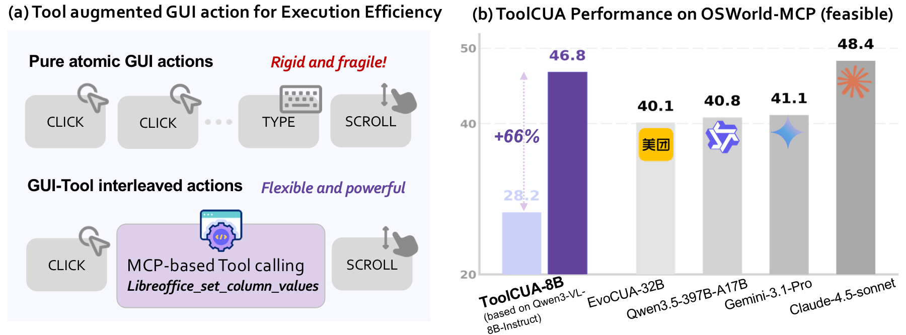
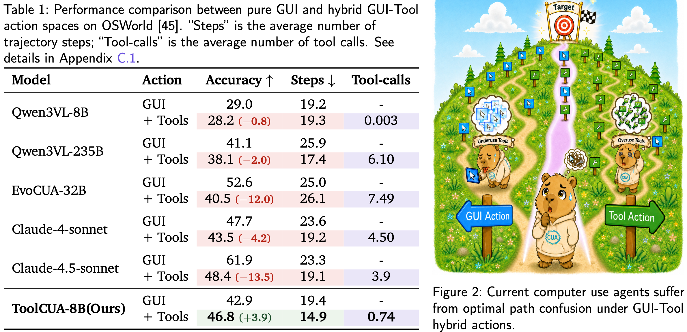
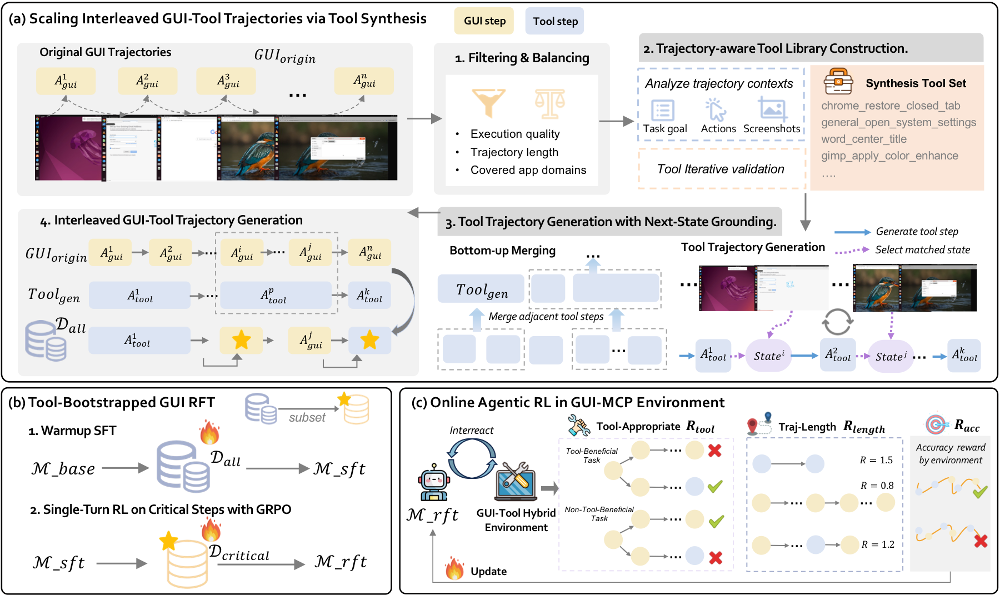
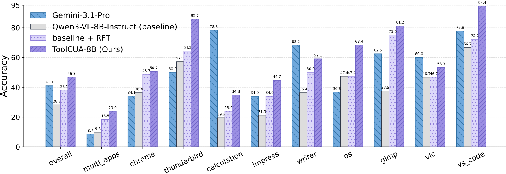

<h1 style="
  font-family:-apple-system,BlinkMacSystemFont,'Segoe UI',Helvetica,Arial,sans-serif;
  font-size:48px;
  font-weight:700;
  line-height:1.25;
  text-align:center;
  margin:0 0 24px;">
  
  ToolCUA: Towards Optimal GUI-Tool Path Orchestration for Computer Use Agents
</h1>

<p align="center">
&nbsp&nbsp🌐 <a href="https://x-plug.github.io/ToolCUA/">Website</a>&nbsp&nbsp | &nbsp&nbsp📑 <a href="https://arxiv.org/abs/2605.12481">Paper</a>&nbsp&nbsp | &nbsp&nbsp🤗 <a href="https://huggingface.co/mPLUG/ToolCUA-8B">ToolCUA-8B</a>&nbsp&nbsp | &nbsp&nbsp📄 <a href="https://x-plug.github.io/ToolCUA/#case-study">Cases</a>
</p>

<div align="center">
  
</div>

<div style="max-width:900px;margin:0 auto;">

## 📢 Updates
- 2026-05-12: 🎉 **Thrilled to release ToolCUA** with the ToolCUA-8B model, evaluation code, and OSWorld-MCP benchmark results.

## 📚 Table of Contents
- [🌟 Introduction](#-introduction)
    - [🔍 Path Selection Confusion Under Hybrid Actions](#-path-selection-confusion-under-hybrid-actions)
    - [🧠 Method Overview](#-method-overview)
    - [Installation \& Download](#installation--download)
    - [🚀 vLLM Serve](#-vllm-serve)
    - [🖥️ Evaluation](#️-evaluation)
  - [📊 Performance](#-performance)
  - [Acknowledge](#acknowledge)
  - [Citation](#citation)

## TODO
- [x] **Tool CUA Model Released**
- [ ] **Data Pipeline**: GUI-Tool interleaved trajectory scaling pipeline
- [ ] **Training Infra**: Asynchronous training-rollout decoupled agentic RL in sandbox


<a id="introduction"></a>
# 🌟 Introduction
<div style="
  max-width: 880px;              /* 可按需调节整体宽度 */
  margin: 0 auto;               /* 居中容器 */
  text-align: justify;          /* 关键：两端对齐 */
  text-justify: inter-word;     /* 优化英文对齐效果 */
  line-height: 1.6;">
  
**ToolCUA** is an end-to-end Computer Use Agent (CUA) designed for **optimal GUI-Tool path orchestration**. Modern CUAs can act through both atomic GUI actions, such as clicking, typing, and scrolling, and high-level tool calls, such as API-based file or application operations. However, simply exposing a model to both action spaces does not make it a reliable desktop agent: the model must learn **when to continue with GUI actions, when to invoke tools, and when to switch back**.

ToolCUA addresses this challenge with a staged training pipeline. We first scale interleaved GUI-Tool trajectories from existing GUI-only data through trajectory-aware tool synthesis. Then, we use Tool-Bootstrapped GUI RFT to acquire tool-calling knowledge and calibrate critical switching decisions. Finally, we optimize the agent with Online Agentic RL in a GUI-Tool environment using a Tool-Efficient Path Reward, encouraging appropriate tool use and shorter execution paths.

<a id="path-selection-confusion-under-hybrid-actions"></a>
### 🔍 Path Selection Confusion Under Hybrid Actions

Giving agents both GUI actions and tool calls does not automatically make them better. In our diagnostic study, hybrid actions introduce a clear **path selection confusion** problem: some models stay GUI-centric and almost never invoke tools, while stronger models may overuse tools, shorten trajectories, and still lose task success. The bottleneck is therefore not tool availability itself, but whether the agent can choose the right GUI-Tool execution path at each state.

<div align="center">
  
</div>

<a id="method-overview"></a>
### 🧠 Method Overview

ToolCUA learns GUI-Tool orchestration through three tightly connected stages: (1) scalable interleaved GUI-Tool trajectory construction from existing GUI corpora, (2) Tool-Bootstrapped GUI RFT for tool knowledge and local switching calibration, and (3) Online Agentic RL with Tool-Efficient Path Reward for trajectory-level optimization.

<div align="center">
  
</div>

</div>


<a id="installation-download"></a>
### Installation & Download

First, install the required transformers dependencies:

```bash
pip install -r requirement.txt
```

Download the model weight from huggingface:
```bash
from huggingface_hub import snapshot_download
snapshot_download(
    repo_id="mPLUG/ToolCUA-8B",
    local_dir="ToolCUA-8B",                
    local_dir_use_symlinks=False  
)
```

<a id="vllm-serve"></a>
### 🚀 vLLM Serve

We recommend using vLLM for production deployment. Requires **vllm>=0.12.0** with `--trust-remote-code`.

```bash
# 8B (single GPU)

MAX_IMAGE=${MAX_IMAGE:-5}
IMAGE_LIMIT_ARGS='{"image": '"$MAX_IMAGE"'}'

PIXEL_ARGS='{"size": {"longest_edge": 3072000, "shortest_edge": 65536}}' # 3000*32*32

vllm serve xPLUG/ToolCUA-8B \
    --max-model-len 32768 \
    --mm-processor-kwargs "$PIXEL_ARGS" \
    --limit-mm-per-prompt "$IMAGE_LIMIT_ARGS" \
    --tensor-parallel-size 1 \
    --allowed-local-media-path '/' \
    --port 4243 \
    --gpu-memory-utilization 0.85 \
    --mm-processor-cache-gb 0 \
    --no-enable-prefix-caching \
    --enforce-eager \
    --max-logprobs 50
```
As ToolCUA-8B is based on Qwen3VL-8B-Instruct, whom you can follow the similar implementation


<a id="evaluation"></a>
### 🖥️ Evaluation

You should first have the complete evaluation environment as [OSWorld](https://github.com/xlang-ai/OSWorld) (for pure GUI settings) or [OSWorld-MCP](https://github.com/X-PLUG/OSWorld-MCP) (for GUI-Tool settings)

There are some key files that you need to place at the right place os OSWorld / OSWorld-MCP evaluation dir

- eval_data with tool_beneficial label: `./eval/evaluaton_data`
- desktop_env: `./eval/desktop_env.py`
- agents_implementation: `./eval/qwen3vl_toolcua_aget_mcp.py`
- eval_main: `./eval/run_multienv_qwen3vl_toolcua_mcp_eval.py`
- 

Command for running in `average@k` and calculate results
```
bash ./eval/passk_run_new.sh

python ./eval/pass_k_results.py --root_path ${RESULT_DIR} --trials 0 1 2
```

---

<a id="performance"></a>
##  📊 Performance

Results are reported on the feasible tasks of **OSWorld-MCP**. We list the **Overall** metrics from the main paper table: Accuracy, Tool Invocation Rate (TIR), and Average Completion Steps (ACS).

| Agent Model | Accuracy ↑ | TIR ↑ | ACS ↓ |
|:--|--:|--:|--:|
| Gemini-2.5-Pro | 20.22 | 17.22 | 29.97 |
| OpenAI o3 | 20.62 | 18.22 | 31.87 |
| Seed1.5-VL | 34.53 | 26.83 | 20.69 |
| Claude-4-Sonnet | 43.54 | 35.74 | 19.76 |
| Gemini-3.1-Pro | 41.14 | 34.23 | 25.40 |
| Claude-4-5-Sonnet | 48.35 | 40.24 | 19.07 |
| Qwen3-VL-235B-A22B | 38.14 | 28.63 | 17.95 |
| Qwen3.5-397B-A17B | 40.84 | 11.71 | 21.86 |
| UI-Tars-1.5-7B | 12.31 | 4.50 | 37.11 |
| EvoCUA-8B | 35.74 | 13.81 | 26.77 |
| EvoCUA-32B | 40.54 | 22.52 | 26.16 |
| GUI-Owl-1.5-8B | 43.84 | 36.04 | 21.19 |
| GUI-Owl-1.5-32B | 48.05 | 41.14 | 24.19 |
| Qwen3-VL-8B-Instruct | 28.23 | 8.41 | 19.34 |
| **ToolCUA-8B** | **46.85** | **24.32** | **14.93** |

Compared with the Qwen3-VL-8B-Instruct baseline, **ToolCUA-8B** improves Accuracy by **+18.62**, TIR by **+15.91**, and reduces ACS by **-4.41**.

<div align="center">
  
</div>
</div>
  

<!-- ## Star History

[](https://www.star-history.com/#xlang-ai/OpenCUA&type=date&legend=top-left) -->

## Acknowledge

We thank Zhaoqing Zhu, Junyang Wang, Jitong Liao and Haowei Liu for their support of training infrastructure, sandbox construction and evaluation.

Our work is motivated by [OpenCUA](https://github.com/xlang-ai/OpenCUA), [ScaleCUA](https://github.com/OpenGVLab/ScaleCUA), [AutoGLM](https://github.com/zai-org/Open-AutoGLM), [CUA-skill](https://github.com/microsoft/cua_skill), [EVOCUA](https://github.com/meituan/EvoCUA), and [Mobile-Agent Series](https://github.com/X-PLUG/MobileAgent). Thanks for their wonderful work.


## Citation

If you use ToolCUA in your research or project, please cite our work:

```bibtex
@article{hu2026toolcua,
  title={ToolCUA: Towards Optimal GUI-Tool Path Orchestration for Computer Use Agents},
  author={Hu, Xuhao and Zhang, Xi and Xu, Haiyang and Qiao, Kyle and Yang, Jingyi and Huang, Xuanjing and Shao, Jing and Yan, Ming and Ye, Jieping},
  journal={arXiv preprint arXiv:2605.12481},
  year={2026}
}
```


</div>
